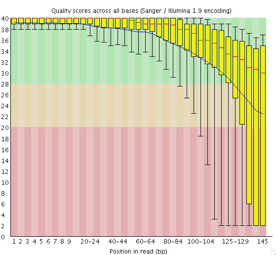
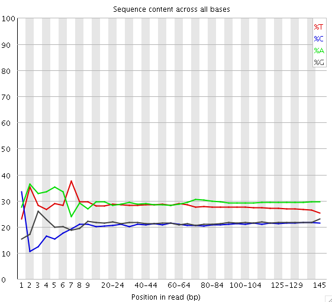
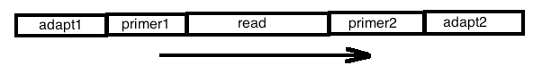
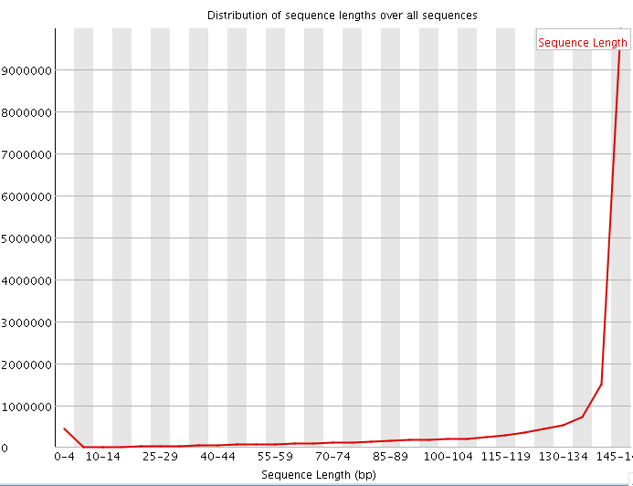

Report to Applied Bioinformatics
========================

## 3. Sequence retrieval and ortholog prediction

### 3.1. Acquisition and pre-processing of high throughput sequencing data

1. Go to the website of the short read archive (SRA) at the NCBI.

	a. How many sequence projects exist for Octopus vulgaris?

		There are 2 projects with octopus vulgaris.

	b. What are the main differences between these projects?

		Both address transcriptome reconstruction and infer a phylogenetic analysis of it. 

		Accession: SRX044574
		Single End reads, 
		Platform: 454 GS FLX
		2.4 Gbases

		Accession: SRX092193
		Paired End reads,
		Platform: Illumina
		2 Mbases

2. Choose the largest sequencing project and perform all the steps to obtain the related sequence data in fastq format. List the steps but do not actually perform the download. 

		To retrieve the sequnce in fastq format, goto the search page and search for the experiment accession number. All the reads for the experiment will be listed, and on the right side of the page, you can choose the download format for the selected read. The accession number for the larger project is: SRX092193

	a. What is the average insert length for this library?

		The insert length is 146 bp. 

	b. What is the URL to the data in the SRA?

		http://www.ncbi.nlm.nih.gov/sra/SRX092193

	c. What is the difference between ln -s , cp, and mv?

		* ln -s
			creates a symbolic link. If the original file is moved, renamed or deleted the file will point to an old non-existing target.

		* cp 
			copies a file or directory from one location to another.

		* mv
			moves a file or directory from one location to another.

	d. How large is the fastq file?

		zipped 1.966.413.355 bytes -> 1,83 GB. 
		unzipped 7.256.195.489 bytes -> 6,75 GB.

3. Make yourself familiar with the fastq format.

	a. What does the sequence header tell us?

		@SRR331946.1.1 ILLUMINA-FCBE01_0027_FC:3:1:1549:1145.1 length=145
		TAGGATNGAAGGTGAGGGATCGTTTTTCAACTCACAAGGATTCTTTGCCAAAAGAAAAGGAATTGTTTCTCGACCAATACTTGATTCACAGGAATTTTCTGTGTTTTCTATATCTCTCCTATAACATTCCTTAGCTCTTCAGTAG
		+SRR331946.1.1 ILLUMINA-FCBE01_0027_FC:3:1:1549:1145.1 length=145
		DDDDDB(D>DA=:?ADDDD,DB<DDDDB<DDDD2DDDDD28DDB>7*BB@DB3<7;;**1<<><<1;*87.57:>BD:DB

		This is an example from the entries listed in the file. The header of each read starts with an '@', followed with additional optional information. 

		Our example file contains information about

			* the sequencing machine
			* flowcell lane
			* tile within the flowcell
			* position of the cluster within the tile
			* read pair information

	b.  How many lines does the information for one sequence read occupy. What information is provided in each line?

		There are four lines for each sequencing read. The first line and the third line contains the header information explained above. The second line in contains the base sequence of the read. The fourth line contains quality information based on the Phred-Score. The default encoding scheme for the quality score ranges from 0 to 93. Therefore the ASCII characters 33 to 126 are used.
 

4. How are paired end reads identied and how are they arranged in the fastq file?

		There is no standard way how to provide information of paired reads in a fastq file, but in our example it is quite obvious that the reads with the following header are paired together:

		@SRR331946.1.1 ILLUMINA-FCBE01_0027_FC:3:1:1549:1145.1 length=145
		@SRR331946.1.2 ILLUMINA-FCBE01_0027_FC:3:1:1549:1145.2 length=145

		Both of the reads have the same flowcell-, tile- and cluster-information. The first read has is marked with ".1" the second read is marked with ".2". 

5. Identify the 4475th read in the fastq file and answer the following questions:

		kurs25@avery:~/data> head -n 17904 octopus_vulgaris.fastq | tail -n 4
		@SRR331946.2238.2 ILLUMINA-FCBE01_0027_FC:3:1:14740:1669.2 length=145
		AAAATGGAAAGGTTAGCCACTCTCGTCTGTCGTCGACTGTTGCCAACTTTCAGTCAGCATGCTCGGCGCAGTCTTCACCGAACTACACCTGCAAGTAGTGATGCTCTGTTCGTGCACCGTGCCCGCACCTATCATCATCACCAAC
		+SRR331946.2238.2 ILLUMINA-FCBE01_0027_FC:3:1:14740:1669.2 length=145
		HHHHHHHHHHHHH?HEGGGGHHHHFHHHHHGHBHHBG@@EHBHHHFHHHHHHHGH3DGDB<DAD>CEEHEBAFDCFDEHEBBBBAEEEEABEB+B65:0>@@@B@AAABA@=9=B88872@0=@#####################

	a. What flowcell coordinates does it have?
	
		This read belongs to flowcell number three.
		
	b. Is it read 1 or read 2 of a read pair?
	
		 This read belongs to flowcell-lane: 3, tile 1, with the coordinates (x: 14740, y: 1669)
		
	c. Consult the internet and find out about the interpretation of Phred quality scores. In which publication have these quality values been described first?

		Ewing, B; Green, P: Base-calling of automated sequencer traces using phred. II. Error probabilities. Genome research 1998/Mar, 8(3):186-94 Department of Molecular Biotechnology, University of Washington, Seattle, Washington 98195-7730, USA.
		
	d. What is the quality value (Phred-Value) of its 3d base?
	
		The quality of the thrid base is an "H". The "H" has the decimal ASCII value of 72. The Phred-Value is 39 (72-33). Q = -10 log10(P). The original probability P, that this base is wrong is: 0.000125893 or 0.0125893 %

6. 	Produce a data summary using the program fastqc.

	a. How many reads are contained in this sequencing project?
	
		The total number of sequences is shown in the first screen of FastQC after loading the fastq-file into it. In this case there are 16.501.336 reads.
	
	b. What is the length of an individual read? 
	![ReadDistribution1][readdist1](figuresDay1/readDistribution1.png)
		
		Every read has the length 145 (see preceding Figure).
		
	c. What is the average GC content of the read?
	
		The GC-content has the value of 42%.

7. Take a look at the read quality information

	a. Interpret the information on the base qualities the program gives.

		The blue line indicates the mean value and the red line within the boxplot indicates the median value. The X-axis is the position of the read and the Y-axis is the Phred-quality score. The mean quality of this plot looks good from the beginning until the middle of the read. The average quality is rapidly droping at the middle of the read. Additional read trimming might help for downstream analysis.
		
	b. Why do you think the program considers this measure as failed?
		
		We observe reads with bad quality at the end. FastQC fails if any lower quartile is less than five, or if the median for any base is less than 20.
	
8. Take a look at the per base sequence content.

	a. How does the observation deviate from you expectation?
	
	
		I would have expected that there is a much fewer difference between the bases of a sequence run, so there would be parallel lines in this plot.
	
	b. Do you have any explanation for this observation?
	
		I think there are sequences, which are overrepresented in their amount. My first guess are PCR-artefacts.
		
9. Identify overrepresented sequences in your reads.

	a. Which overrepresented sequences does the program highlight and what is their likely origin?
	
		There are two overrepresented sequences, which may have their origin in PCR-primer artifacts, one in "Illumina Single end PCR Primer" and one in "Illumina Paired End PCR Primer". FastQC queries each overrepresented sequence in a database to get a first guess of the origin. Only the first 50 bases are called representative by FastQC.
		
		1: AATAATTAGATCGGAAGAGCGTCGTGTAGGGAAAGAGTGTAGATCTCGGT
		2: AATTATTAGATCGGAAGAGCGGTTCAGCAGGAATGCCCAGACCCATATCG
	
	b. Draw a sketch depicting the sequencing primer, the insert and the position of the overrepresented sequence.
	
		
		The sequencing starts at the end of primer1 and seqeuences the read including the primer2.

	c. What is the percentage of reads displaying these sequences?
		
		1: 0,991 %
		2: 0,883 %
		
	d. How is the result from the previous point correlated to the average insert length of the library and the read length of the sequences? 

		The insert length is the same as the length of the sequences, this is due to the fact, that there are as many base calls. 

10. Processing of the sequence reads with *cutadapt*. Note, to run this program for testing you have to log on to zuse since the dmp computers do not have the required python 2.6 installed. For running cutadapt on the Octopus vulgaris reads submit the program via *sge* choosing the -q compute option.

	a. What does cutadapt do?
	
		cutadapt removes adapter sequences from fastq data. This is usually necessary when the read length of the sequencing machine is longer than the molecule that is sequenced, for example when sequencing microRNAs. 
		
		In our case (b) it trims reads, based on the Phred quality score and clips adapter sequences. 
	
	b. Process the raw reads. Chose a Phred value of 20 as the quality limit and clip the adapter sequences using the option a. What sequence do you have to provide? From where do you get this information?

		submit2sge -q dmp -N mytrimming "cutadapt -a 'AATAATTAGATCGGAAGAGCGTCGTGTAGGGAAAGAGTGTAGATCTCGGT' -a 'AATTATTAGATCGGAAGAGCGGTTCAGCAGGAATGCCGAGACCGATATCG' -q 20 octopus_vulgaris.fastq -o trimmed.fastq"
	
		We have to provide the overrepresented sequences of the preceding task. 
	
	c. How does the option a differ from the option b. In what instances would you require option b.

  		-a ADAPTER, --adapter=ADAPTER
				Sequence of an adapter that was ligated to the 3' end.
				The adapter itself and anything that follows is
				trimmed. If multiple -a, -b or -g options are given,
				only the best matching adapter is trimmed.
  		-b ADAPTER, --anywhere=ADAPTER
				Sequence of an adapter that was ligated to the 5' or
				3' end. If the adapter is found within the read or
				overlapping the 3' end of the read, the behavior is
				the same as for the -a option. If the adapter overlaps
				the 5' end (beginning of the read), the initial
				portion of the read matching the adapter is trimmed,
				but anything that follows is kept. If multiple -a, -b
				or -g options are given, only the best matching
				adapter is trimmed.
	
11. Redo the fastqc analysis with the processed sequence reads and compare the results with the initial run on the unprocessed sequences.

	a. How many reads have you retained?
	
		There are as many reads as we have observed in the first FastQC analysis (16.501.336).
	
	b. How long are the sequences, and what do you conclude from the results?
		
		
		The readlength deviates starting from zero to 145. Preceeding Figure shows the distribution of the sequence length.
	
	c. Why does the Per sequence GC content measure now fail?
	
		This module will indicate a failure if the sum of the deviations from the normal distribution represents more than 30% of the reads. In our analysis has not failed. It gives a warning, which indicates that the sum of the deviation from the normal distriubtion represents more than 15%.

12. Prior to assembling the sequence reads into contigs, split the read pairs of your cutadapt-processed fastq files into two sequences using the tool separate readpairs.pl. Why is this step necessary?

		Because trinity isn't able to distinguish the paired reads, when they are in the same file.

13. Sequence assembly with Trinity
	
	a. What are the main steps that Trinity perform?
	
		Trinity is a method for transcriptome reconstruction using de Bruijn graphs to assemble a gene on transcirptomal level. It consists of three different modules (Inchworm, Chrysalis, and Butterfly). Inchworm assembles unique sequences into transcripts and reports unique portions of alternatively spliced transcripts. Chrysalis clusters the Inchworm contigs into clusters (or supercontigs) and constructs the de Bruijn graph. Butterfly process each individual graph and traves each graph to report full length transcriptome for alternativly spliced isoforms. 
	
	b. Why are we using Trinity and not SOAPDenovo?
		
		We are using RNA-Seq data and want to assemble a transcriptome. SOAPDenovo is used to assemble a genome. SOAPdenovo-Trans could be used to reconstruct a transcriptome.
	
14. Have a look at the Trinity output:

	a. How many sequences are in the resulting file?
	
		kurs25@avery:~/data/day1/trinity/trinity> cat Trinity.fasta | grep "^>" | wc -l
		63022
		
		There are 63.022 sequences in the file. 
	
	b. Compute a summary of your fasta file!
	
		kurs25@avery:~/data/day1/trinity/trinity> perl count_fasta.pl Trinity.fasta 
		200:299         25758
		300:399         12982
		400:499         7126
		500:599         4282
		600:699         2967
		700:799         2059
		800:899         1511
		900:999         1201
		1000:1099       941
		1100:1199       726
		1200:1299       634
		1300:1399       468
		1400:1499       426
		1500:1599       337
		1600:1699       260
		1700:1799       219
		1800:1899       189
		1900:1999       141
		2000:2099       121
		2100:2199       103
		2200:2299       87
		2300:2399       66
		2400:2499       51
		2500:2599       48
		2600:2699       42
		2700:2799       31
		2800:2899       39
		2900:2999       27
		3000:3099       22
		3100:3199       35
		3200:3299       17
		3300:3399       13
		3400:3499       12
		3500:3599       8
		3600:3699       13
		3700:3799       7
		3800:3899       8
		3900:3999       5
		4000:4099       5
		4100:4199       2
		4200:4299       4
		4300:4399       0
		4400:4499       3
		4500:4599       0
		4600:4699       1
		4700:4799       3
		4800:4899       1
		4900:4999       3
		5000:5099       4
		5100:5199       6
		5200:5299       1
		5300:5399       1
		5400:5499       0
		5500:5599       1
		5600:5699       0
		5700:5799       0
		5800:5899       0
		5900:5999       1
		6000:6099       0
		6100:6199       0
		6200:6299       0
		6300:6399       1
		6400:6499       0
		6500:6599       0
		6600:6699       0
		6700:6799       0
		6800:6899       0
		6900:6999       0
		7000:7099       0
		7100:7199       1
		7200:7299       0
		7300:7399       0
		7400:7499       0
		7500:7599       0
		7600:7699       0
		7700:7799       0
		7800:7899       1
		7900:7999       1

		Total length of sequence:       30087732 bp
		Total number of sequences:      63022
		N25 stats:                      25% of total sequence length is contained in the 4726 sequences >= 1038 bp
		N50 stats:                      50% of total sequence length is contained in the 15023 sequences >= 545 bp
		N75 stats:                      75% of total sequence length is contained in the 33341 sequences >= 322 bp
		Total GC count:                 11696181 bp
		GC %:                           38.87 %
	
15. Identify the 1000 longest contigs in your assembly. 

	a. Extract them from the contig file and store them in a separate file for further analysis. Name this file *octopus_vulgaris.contig.max2k.fa*.
	
		#!/usr/bin/python 
	
		import sys 
		import re 
	
		file = sys.argv[1] 
		ofile = sys.argv[2] 
	
		fobj = open(file, "r") 
		seqsl = {} 
		lastkey = None 
		print "Counting ..."
		for line in fobj : 
			strl = list(line) 
			if strl[0] == ">" : 
				m = re.search("len\=(\w+) ",line) 
				seqlen = m.group(1) 
				lastkey = float(seqlen) 
				while lastkey in seqsl: 
					lastkey = lastkey + 0.001 
				print str(lastkey) + ",", 
				seqsl[lastkey] = [] 
			seqsl[lastkey].append(line) 
		fobj.seek(0) 
		print "Sorting ..." 
		sortseqsl = sorted(seqsl.keys(), reverse=True) 
		print "Output ..." 
		outfile = open(ofile, "w") 
		for i in range(0,1000) : 
			print str(sortseqsl[i]) +  ",", 
			rows = seqsl[sortseqsl[i]] 
			for row in rows : 
				outfile.write(row) 
		print "END"
	
	b. What length range do these 1000 sequences cover?
	
		1864 - 7945