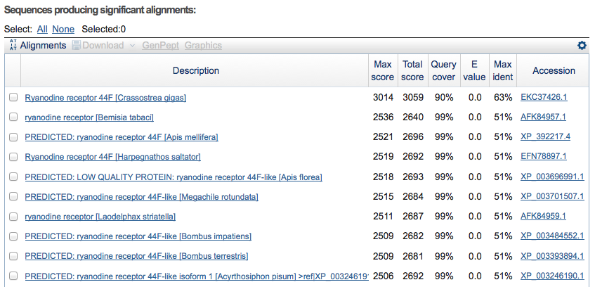
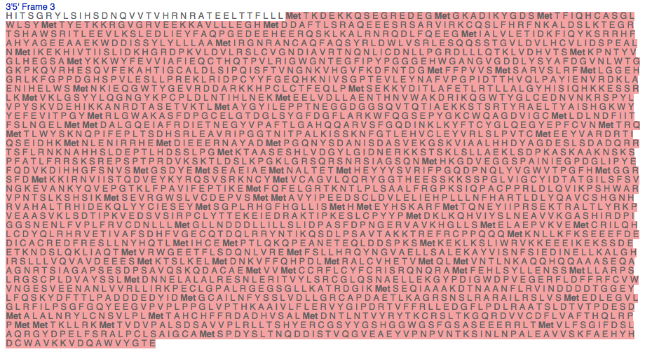
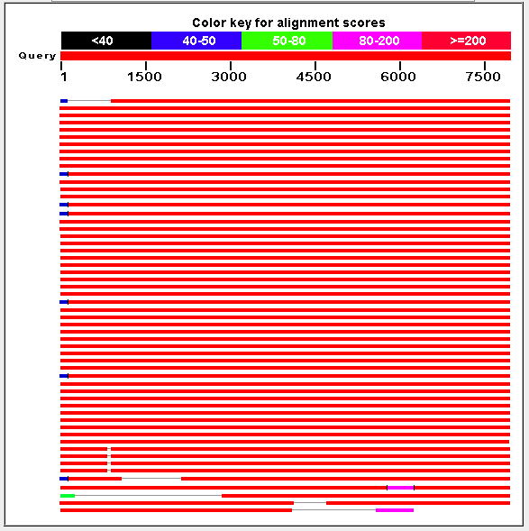

1. Take the longest contig from your Octopus vulgaris assembly and use the BlastX tool at [http://blast.ncbi.nlm.nih.gov/blast.cgi](http://blast.ncbi.nlm.nih.gov/blast.cgi) to identify the best matching protein in the non-redundant protein database.
	a. Summarize your findings (name, function of the protein, species, length of the hit, etc.

		Blastx translates the query and finds similar proteins in translated database.
		Most of our findings refer to the receptor 44F in different species.
	
		
		Ryanodine receptor 44F is known for the larva development in drosophila melanogaster, in general it is associated with the calcium channel. 
		
		Species | Length of the hit | Number of matches
		Ryanodine receptor 44F [Crassostrea gigas] | 2510 | 2
		ryanodine receptor [Bemisia tabaci] | 5142 | 2
		PREDICTED: ryanodine receptor 44F [Apis mellifera] | 5082 | 3
		Ryanodine receptor 44F [Harpegnathos saltator] | 5080 | 3
		
		In this four results there is one big region, which overlaps quite good (roughly 2000 aminos) and the other ones are small regions (about 70 aminos).
		
	b. How many best hits do you find when looking at the evalue, how many best hits do you find when considering the score?
	
		The first hundret results have an e-value from zero. The best score has one hit of the Crassostrea gigas species with 3014. 
	
	c. What are your conclusions concerning the characterization of your query sequence? Do the Blast results follow your expectation?
	
		There are many homologues sequences of the same protein in the result as we would have expect. 
	
	d. Retrieve the protein sequence of the highest scoring Blast.
	
		ORIGIN      
		      mlilltgyvf ggdvlrlfhg hmdeclaipe agsenefsav myetgavcsh arslwrieii
		      ktkwsgafiq wgqqcrlrhv tsgrylgvth dkqvitvhrn kaaekavtfy llqtkdekkq
		      letseeegmg ksdikygdti vfiqhsdtgl wlsyqttevk kkgvgkveek kavmlveghm
		      ddgftfsraq eeesrsarvi rkcqsifhrf nnvldtlkte grtgiawsri tlsevlkcle
		      dmieyfaqpd kneeheekqn klralrnrqd lfqeegmial iletidkfsq yksprhfahy
		      ageeaastye diasylylll aamiqgnran caqfaqsyrl dwlvrrlegq qsskgvldvl
		      hcvlidspea lnmikekhii tiislidrhg rdpkvldvlr slcvgngvav rtnqnlicdn
		      llpgkdlllq tslinhvssi rpniyvgvke gssmykkwyf evvvtqfeaa nhlpptmrvg
		      wantegfipy pgggehrggn gigddlysya ydgvnlwtgg kkkavrnsde tfkpgdivgc
		      gldltipqit fsvngkqvlg ffkdcnltgl ffpvismsar vgcrfmlgge hgklkhgppq
		      ghsavveslm pkdrlrlepc fmfgeaskni lsgpteitdy vpfvpkaidt aniqlpiyie
		      kvrdrlaenl heiwamskie qgwkfgeird dqrktnpslt nfeklpksek kyvvtvayet
		      lrqtllaigy hismdaqkke nnrlkmiklg ndflqsngyk ptpldlstvq msevledlvd
		      mlaenthnvw akdrikngwt yglfedaank rspflvpysr vdekikkanr eeanqivktl
		      laygynlepp tsemgesslr ayisekaeml tktrtyraet tygvtsgkwy yefevitaef
		      mkvgwakisl dpstelgldg nsyafdgfgg rkwnhgaepy gkqwrsgdvi gcmldlndkt
		      itfslngelm mdsmgqeiaf rgvetgepyv pavtlschqq cklnlgqdvn tlkfftccgl
		      qegyepfcvn mtrpmtlwyg kelalfgdig edhpslrvqr vpgaknvtpc lkvlsktfgt
		      lekvhleylr lglpvickde fgvrsatypt ayekrmnlen irrhemdiqe esgysvndld
		      ttiengsldn sriltdtkqa sspsnsgpse ltqpeatpit pvngeasihe ddeeyademm
		      ngdtefrksg ysedtefsqt tasdrrkkyl dksgrhsldd ssqdkmstsr ikpassesrl
		      sgsdkpslnv pegkrsssrl sllgdklmdt aksigdkktk tgrspfpsif kknkgvdips
		      qdgkrtrsve ygsidrrvdh gksqrdqqrq pnksatlpms rmaksldset gsstqapvin
		      ieaprgmipy efqdaigrrr hsegsdaeis daelselqam admideyhya vrilpgqdpa
		      qvfvgwvtpg fhfsettfdm kktrhvvltt lesdynlkqs vsrkncymvs agdlqqryag
		      lsqessgkra spgfvvgcfi dtstgllsft vnskevanky qvepgtrlfp aviceptske
		      mlqfelghtk ytlplsaavf rgpkqvipac pprldvqvln qscwgrvpsn tlkihtlkms
		      etkgwsmlcd navemlsvyi peedrsidvl elvehpslle fhaktlelym avcyhgnhrv
		      shalthhvdl rqmmhciqcl slcgplrmgy hdlliamhle shatarqmtq neyiipltpg
		      tkelslyrrp snqdrqykik hsipnmdasv sirpalfite kqiegrikda gqestspffp
		      ierlkeyilr alqeatikga ahirdpvggs nanlfvpllr vvdnllvmgq ltdddliyvl
		      rlidpeafnd hyipgdkkdg ilnmkldeav klemchflqh lcdlqlrhrv esvvafsdny
		      vescqndqkr ryieikqsdl psavtakmtr efrcppaeqm rnllafknpd dseepvqysp
		      fqeemharlw kfhrdlihhc smptapedqe gekekqeevl ppttgekllq lvwkakeeap
		      vqettngesa satlqnliqq tvikwaeelt iqsqdlvrem fsllhrqyng igeqlkaldk
		      ayvisigskd dikqllralg nirslllvqa gpseeelmkn slkelmdnkv ffqhpdlmra
		      lcvhetvmql mvntlnkaqq qqqsansama elissqqgrr gsfipsgtld slvehtkdaa
		      aemvvmccrf lcyfcrtsrq nqramfehls yllenssmll arpslrgscp ldvgysslmd
		      nnelalalre shlekiamyl srcglqsnae llekgypdig wdpvegerfl dflrfcvwvn
		      gesveenanl vvrllirrpe clgpalrgeg ggllkaikdg irmseqiaas kdslsgsyls
		      alndeddsgg rylfqskydf sslppedded yidmggailt fysslvdllg rcapeaeaik
		      sgrsdsirar ailrslvsme dlegvlglrf ilpvnqppps sedgkilshl
	
	
2. Translate the Octopus vulgaris contig into a protein sequence. Use the online Sequence Manipulation Suite [http://www.bioinformatics.org/sms2](http://www.bioinformatics.org/sms2) (sms) for this purpose. 

	a. Which reading frame of the mRNA is coding the protein sequnence?
	
		We have used the ORF-finder at: [http://www.bioinformatics.org/sms2/orf_find.html](http://www.bioinformatics.org/sms2/orf_find.html) to try out some of the possible reading frames. Finnaly we used reading frame three at the reverse strand. 
		
	b. How long are the UTRs?
		
		UTRs are untranslated regions. An example for this region could be before an Methionine occurs in the sequence. A blast of the sequence leads us to the conclusion, that the Methionine region must be before the start of the region. So it is impossilbe to find out how long this UTR is.
		
	c. Obtain the protein sequence from the start to (just before) the stop codon?
	
		The stop codon is not in the contig. We have checked the starting (ethionine) and stoping positions in the sequence with expasy translate tool (http://web.expasy.org/cgi-bin/translate/dna_aa). Consider the white region to be the 5' UTR. The red region is the coding region. 
	
		
		Considering the following image (of the blastx result), it is not for sure that the starting position of the expasy query is correct, because most of the matches we find have a region (~ 300 aminos) before our contig starts. 
	
		
3. 

4. Compare the protein sequences from your best Blast hit and from the translated Octopus sequence.
 
	a. Align the two sequences with clustalw.
		
		clustalw align_merge.fq 
		
		The command from does a multiple alignment with the sequences in the align_merge.fq file. The output is a aln file, which gives you the output of the alignment (see in c.) and a dnd-file which contains information for phylognetic recontruction of these sequences.
		
		
	b. Align the two sequences with maft. Since the default output format of maft is fasta, use the option -clustalout to obtain the alignment in clustal format).
	
		mafft --clustalout align_merge.fq > align_merge_mafft.out
	
	c. Compare the two alignments quickly by eye. What differences are prominent (within the rst couple of hundred amino acids) and what conclusions concerning the use of alignment tools do you draw from these dierences?
	
			CLUSTAL W (1.83) multiple sequence alignment
		
			longest_contig_blast           MLILLTGYVFGGDVLRLFHGHMDECLAIPEAGSENEFSAVMYETGAVCSH
			longest_contig_translated      --------------------------------------------------
		
		
			longest_contig_blast           ARSLWRIEIIKTKWSGAFIQWGQQCRLRHVTSGRYLGVTHDKQVITVHRN
			longest_contig_translated      ----------------------------HITSGRYLSIHSDNQVVTVHRN
			                                                           *:******.:  *:**:*****
		
			longest_contig_blast           KAAEKAVTFYLLQTKDEKKQLETSEEEGMGKSDIKYGDTIVFIQHSDTGL
			longest_contig_translated      RATEELTTFLLLMTKDEKKQSEGREDEGMGKADIKYGDSMTFIQHCASGL
			                               :*:*: .** ** ******* *  *:*****:******::.****. :**
		
			longest_contig_blast           WLSYQTTEVKKKGVGKVEEKKAVMLVEGHMDDGFTFSRAQEEESRSARVI
			longest_contig_translated      WLSYMTYETKKRGVGRVEEKKAVLLLEGHMDDAFTLSRAQEEESRSARVI
		                                   **** * *.**:***:*******:*:******.**:**************
		

			CLUSTAL format alignment by MAFFT FFT-NS-1 (v6.935b)
					
			blasted_longest MLILLTGYVFGGDVLRLFHGHMDECLAIPEAGSENEFSAVMYETGAVCSHARSLWRIEII
			translated_long ------------------------------------------------------------
			
			
			blasted_longest KTKWSGAFIQWGQQCRLRHVTSGRYLGVTHDKQVITVHRNKAAEKAVTFYLLQTKDEKKQ
			translated_long ------------------HITSGRYLSIHSDNQVVTVHRNRATEELTTFLLLMTKDEKKQ
			                                  *:******.:  *:**:*****:*:*: .** ** *******
			
			blasted_longest LETSEEEGMGKSDIKYGDTIVFIQHSDTGLWLSYQTTEVKKKGVGKVEEKKAVMLVEGHM
			translated_long SEGREDEGMGKADIKYGDSMTFIQHCASGLWLSYMTYETKKRGVGRVEEKKAVLLLEGHM
			                 *  *:*****:******::.****. :****** * *.**:***:*******:*:****
			
			blasted_longest DDGFTFSRAQEEESRSARVIRKCQSIFHRFNNVLDTLKTEGRTGIAWSRITLSEVLKCLE
			translated_long DDAFTLSRAQEEESRSARVIRKCQSLFHRFNKALDSLKTEGRTSHAWSRITLEEVLKSLE
			                **.**:*******************:*****:.**:*******. *******.****.**
	
5. Run a local BlastX search to compare your 1000 contigs to the sequences in the database contaminationDb a /project/kurs-home/share/applBioinf12/blast_db. Submit the BLAST job via the SGE and use 4 processors. Use the program blastall -p blastx and the options -e 0.0001 -v 25 -b 25 for the BlastX search.

		kurs25@zuse:~/data/day2> submit2sge -q dmp -N myblast -s 4 "blastall -i octopus_vulgaris.contig.max1k.fa -p blastx -e 0.0001 -v 25 -o blastout -d /project/kurs-home/share/applbioinf12/blast_db/contaminationDb"
		                                                                    Score    E
		Sequences producing significant alignments:                         (bits) Value
		
		|8062|123762| [Lottia gigantea]                                      3180   0.0  
		|20253|159249@estExt_Genewise1.C_5340008| [Capitella capitata]       2872   0.0  
		|8221|ENSAPMP00000032594| [Apis mellifera]                           2475   0.0  
		|12048|ENSAPMP00000010433| [Apis mellifera]                          2468   0.0  
		|11842|DGIL_AUG5s4004g14t1| [Acyrthosiphon pisum]                    2467   0.0  
		|12298|ENSAPMP00000033367| [Apis mellifera]                          2464   0.0  
		|8699|310496| [Daphnia pulex]                                        2444   0.0  
		|8417|PHUM135890| [Pediculus humanus]                                2426   0.0  
		|12459|AAEL003837-PA| [Aedes aegypti]                                2425   0.0  
		|9856|AGAP010750-PA| [Anopheles gambiae]                             2424   0.0  
		|751|FBpp0278393| [Drosophila pseudoobscura]                         2419   0.0  
		|10444|FBpp0249821| [Drosophila willistoni]                          2414   0.0  
		|744|FBpp0168143| [Drosophila mojavensis]                            2412   0.0  
		|15291|FBpp0087721| [Drosophila melanogaster]                        2411   0.0  
		|14093|FBpp0264241| [Drosophila yakuba]                              2410   0.0  
		|2049|FBpp0235714| [Drosophila virilis]                              2409   0.0  
		|12711|FBpp0087718| [Drosophila melanogaster]                        2408   0.0  
		|16059|FBpp0087719| [Drosophila melanogaster]                        2407   0.0  
		|1277|FBpp0087720| [Drosophila melanogaster]                         2405   0.0  
		|4972|FBpp0141935| [Drosophila erecta]                               2395   0.0  
		|11577|FBpp0157007| [Drosophila grimshawi]                           2380   0.0  
		|5466|FBpp0115576| [Drosophila ananassae]                            2374   0.0  
		|987|GLEAN_02610| [Tribolium castaneum]                              2354   0.0  
		|8552|BGIBMGA013297| [Bombyx mori]                                   2334   0.0  
		|10531|LOAG_00665T0| [Loa loa]                                       2135   0.0  
		
		Blastx translates the dna-sequences into protein-sequences and finds the closest related species on a protein level. These are the closest related speceis.

6. Search in your 1000 Octopus contigs for orthologs to proteins conserved in the Lophotrochozoa. Install/Copy the HaMStR package into your home directory. You can retrieve the package from the course repository. Use the HaMStR package, lophotrochozoa hmmer3 as the core-ortholog set, and Lottia gigantea (lotgi 2713) as reference species. 

	a. How many orthologous groups were identied?
		
	b. How many Octopus sequences are identied as ortholog? 
	
	c. Explain the difference in number between (a) and (b).
	
	d. Extract the Octopus sequences from the orthologous groups and store for later use. 
	
	e. How many dierent species does the larges group of orthologs contain?
	
	f. Which group is the one that contains the most Octopus sequences?

 