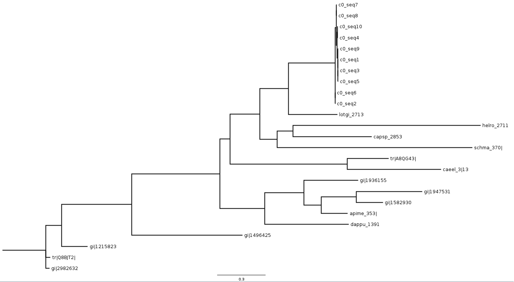
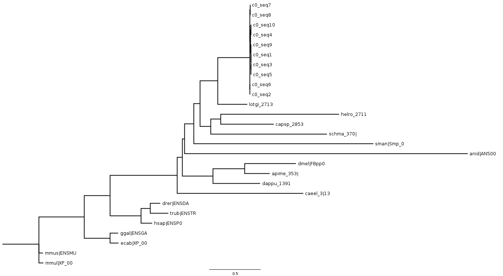
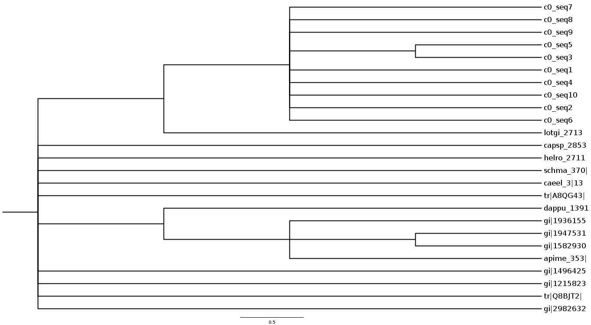
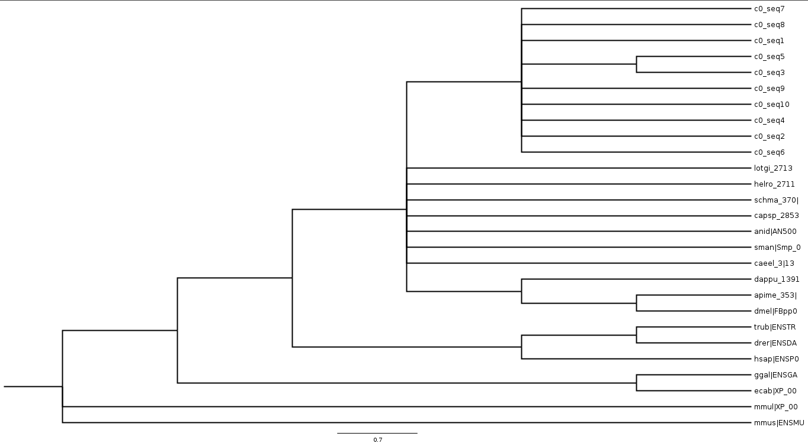

## 5. Phylogeny reconstruction

## Introduction

The aim of this exercise is to get the phylogenetic relationships of the ortholog sequences found previously. Therefore we choose an ortholog group and expand it even further with orthologs from InParanoid and orthoMcl. We align the sequences of the proteins and perform a maximum-likelyhood-tree-reconstruction. Additional a strict-consensus tree is created from 100 boot-strap trees.

1. From the HaMStR-output select those genes that identified more than 2 Octopus ortholog

		Following shell script is used to extract the genes:
	
		#!/bin/bash
		for f in $(ls [0-9]*.fa)
		do
			octo_count=$(grep "|comp" $f | wc -l)
			if [ "$octo_count" -gt "2" ]
			then
				echo $f
    		egrep -h -o "\|[[:alnum:]_]+\|[[:alnum:]_]+" $f
			fi
		done

2. List the ids of these gene
		
		111219.fa
		|caeel_3|5516
		|schma_370|4728
		|apime_353|18256
		|capsp_2853|8033
		|dappu_1391|23169
		|helro_2711|11899
		|lotgi_2713|16857
		|lotgi_2713|lottia_gigantea
		|lotgi_2713|lottia_gigantea
		|lotgi_2713|lottia_gigantea
		111358.fa
		|caeel_3|10476
		|schma_370|4731
		|apime_353|5024
		|capsp_2853|21599
		|dappu_1391|19556
		|helro_2711|13303
		|lotgi_2713|2943
		|lotgi_2713|lottia_gigantea
		|lotgi_2713|lottia_gigantea
		|lotgi_2713|lottia_gigantea
		|lotgi_2713|lottia_gigantea
		|lotgi_2713|lottia_gigantea
		|lotgi_2713|lottia_gigantea
		111369.fa
		|caeel_3|14598
		|schma_370|3947
		|apime_353|17677
		|capsp_2853|22830
		|dappu_1391|7337
		|helro_2711|5863
		|lotgi_2713|5776
		|lotgi_2713|lottia_gigantea
		|lotgi_2713|lottia_gigantea
		|lotgi_2713|lottia_gigantea
		111520.fa
		|caeel_3|11517
		|schma_370|8248
		|apime_353|23146
		|capsp_2853|7425
		|dappu_1391|22671
		|helro_2711|17716
		|lotgi_2713|5492
		|lotgi_2713|lottia_gigantea
		|lotgi_2713|lottia_gigantea
		|lotgi_2713|lottia_gigantea
		111609.fa
		|caeel_3|9926
		|schma_370|13077
		|apime_353|2427
		|capsp_2853|23241
		|dappu_1391|17979
		|helro_2711|21194
		|lotgi_2713|23345
		|lotgi_2713|lottia_gigantea
		|lotgi_2713|lottia_gigantea
		|lotgi_2713|lottia_gigantea
		|lotgi_2713|lottia_gigantea
		|lotgi_2713|lottia_gigantea
		111677.fa
		|caeel_3|22624
		|schma_370|8211
		|apime_353|12837
		|capsp_2853|19344
		|dappu_1391|9449
		|helro_2711|237
		|lotgi_2713|13141
		|lotgi_2713|lottia_gigantea
		|lotgi_2713|lottia_gigantea
		|lotgi_2713|lottia_gigantea
		|lotgi_2713|lottia_gigantea
		|lotgi_2713|lottia_gigantea
		|lotgi_2713|lottia_gigantea
		111749.fa
		|caeel_3|6030
		|schma_370|9776
		|apime_353|6067
		|capsp_2853|24106
		|dappu_1391|28864
		|helro_2711|22555
		|lotgi_2713|7727
		|lotgi_2713|lottia_gigantea
		|lotgi_2713|lottia_gigantea
		|lotgi_2713|lottia_gigantea
		|lotgi_2713|lottia_gigantea
		111761.fa
		|caeel_3|9663
		|schma_370|11539
		|apime_353|22268
		|capsp_2853|3637
		|dappu_1391|10138
		|helro_2711|22489
		|lotgi_2713|680
		|lotgi_2713|lottia_gigantea
		|lotgi_2713|lottia_gigantea
		|lotgi_2713|lottia_gigantea
		|lotgi_2713|lottia_gigantea
		|lotgi_2713|lottia_gigantea
		|lotgi_2713|lottia_gigantea
		|lotgi_2713|lottia_gigantea
		111794.fa
		|caeel_3|23833
		|schma_370|5061
		|apime_353|11132
		|capsp_2853|3356
		|dappu_1391|10142
		|helro_2711|17724
		|lotgi_2713|965
		|lotgi_2713|lottia_gigantea
		|lotgi_2713|lottia_gigantea
		|lotgi_2713|lottia_gigantea
		111813.fa
		|caeel_3|26134
		|schma_370|7819
		|apime_353|7773
		|capsp_2853|12100
		|dappu_1391|3778
		|helro_2711|15086
		|lotgi_2713|8606
		|lotgi_2713|lottia_gigantea
		|lotgi_2713|lottia_gigantea
		|lotgi_2713|lottia_gigantea
		111846.fa
		|caeel_3|14543
		|schma_370|5036
		|apime_353|13575
		|capsp_2853|11202
		|dappu_1391|23865
		|helro_2711|12434
		|lotgi_2713|22445
		|lotgi_2713|lottia_gigantea
		|lotgi_2713|lottia_gigantea
		|lotgi_2713|lottia_gigantea
		|lotgi_2713|lottia_gigantea
		|lotgi_2713|lottia_gigantea
		|lotgi_2713|lottia_gigantea
		|lotgi_2713|lottia_gigantea
		|lotgi_2713|lottia_gigantea
		111923.fa
		|caeel_3|13364
		|schma_370|8512
		|apime_353|3053
		|capsp_2853|19375
		|dappu_1391|3486
		|helro_2711|20870
		|lotgi_2713|2343
		|lotgi_2713|lottia_gigantea
		|lotgi_2713|lottia_gigantea
		|lotgi_2713|lottia_gigantea
		|lotgi_2713|lottia_gigantea
		|lotgi_2713|lottia_gigantea
		|lotgi_2713|lottia_gigantea
		|lotgi_2713|lottia_gigantea
		|lotgi_2713|lottia_gigantea
		|lotgi_2713|lottia_gigantea
		|lotgi_2713|lottia_gigantea
		111934.fa
		|caeel_3|18303
		|schma_370|1216
		|apime_353|26041
		|capsp_2853|27103
		|dappu_1391|12579
		|helro_2711|12423
		|lotgi_2713|11544
		|lotgi_2713|lottia_gigantea
		|lotgi_2713|lottia_gigantea
		|lotgi_2713|lottia_gigantea
		111949.fa
		|caeel_3|12561
		|schma_370|3662
		|apime_353|6810
		|capsp_2853|11911
		|dappu_1391|9301
		|helro_2711|23250
		|lotgi_2713|10031
		|lotgi_2713|lottia_gigantea
		|lotgi_2713|lottia_gigantea
		|lotgi_2713|lottia_gigantea
		112153.fa
		|caeel_3|17302
		|schma_370|1096
		|apime_353|18864
		|capsp_2853|27850
		|dappu_1391|19307
		|helro_2711|11045
		|lotgi_2713|22808
		|lotgi_2713|lottia_gigantea
		|lotgi_2713|lottia_gigantea
		|lotgi_2713|lottia_gigantea
		112257.fa
		|caeel_3|4924
		|schma_370|851
		|apime_353|15550
		|capsp_2853|12362
		|dappu_1391|14248
		|helro_2711|14564
		|lotgi_2713|19584
		|lotgi_2713|lottia_gigantea
		|lotgi_2713|lottia_gigantea
		|lotgi_2713|lottia_gigantea
		|lotgi_2713|lottia_gigantea
		112258.fa
		|caeel_3|26012
		|schma_370|7431
		|apime_353|5096
		|capsp_2853|16707
		|dappu_1391|7511
		|helro_2711|1827
		|lotgi_2713|16440
		|lotgi_2713|lottia_gigantea
		|lotgi_2713|lottia_gigantea
		|lotgi_2713|lottia_gigantea
		|lotgi_2713|lottia_gigantea
		|lotgi_2713|lottia_gigantea
		|lotgi_2713|lottia_gigantea
		112347.fa
		|caeel_3|11878
		|schma_370|6811
		|apime_353|25501
		|capsp_2853|9352
		|dappu_1391|8206
		|helro_2711|7187
		|lotgi_2713|17065
		|lotgi_2713|lottia_gigantea
		|lotgi_2713|lottia_gigantea
		|lotgi_2713|lottia_gigantea
		|lotgi_2713|lottia_gigantea
		
		The various repetitions of the gene "lotgi_2713|lottia_gigantea" are found orthologs with our sample (c0-c10)

3. Choose one of these genes. Expand the ortholog cluster
		
		cat 111923.fa | grep -A 1 "|caeel_3|13364"
		>111219|lotgi_2713|16857			MIGRKEKERERPYYRDPDDPEYIKDLQRPAVIKEDLSEMERRKRVQQILESKSFCHELEEVIRQECDTARTDPDHLQVLQKLSDLTVPQGNMSFGNLHTYGGNTIAIADLRGNEKYSKAERIQRNKLACLFRLADLFQWSQGIHNEISYRTNDEDNTFLMNPFGLLYHEITAATIVKIDENGKILDCGTLKAGVNQPAFLLHSAIYKAHPMVRCILHMHTAIVAAVASMKCGLLPLCKEAMVLGPVGYHDYQDIGDDDIQFDEIIANLGDKNVLFLRNQGFLVVGDTIEHATFLANNTVIACETQVRAARAGLDNLIIPEEKAIQRAFRNSRNTNSLKRNGTVDWRVGELEWESWMRVLDHANFQTGHVYRQPQLRPKSAMSTSMVNNNDVAVPPTTSAYGQIDETNLESVSAHRLALLRKEQERVRWMNSPNAYQKVEFLEYGADNPKKITKWVHDVNVPSASGTPVKISSVHQFSPASSNPKEFKEKQKAIKENNRLGTLSAGPQSQILDSVTYEDIALLIKPDNDGTVGQSSTADRAILIGTASKGIIDRQFQHHAQVYHQIYAPNPFSVETDADIKKYVDMVKAKNSQSAPVSARSGYSQYDEVEADTVSLMQGVREHKLSQAALSASDDGLNAGISPNNVRTSEESVNTSYMSQSVVFDCDHPSPMSISTEYPEKVKMTRFSSTQGTSEGNTTSRSCTTASEEEKPTKDEKKKKKKGFLSFMRKKDK
		
	a. with sequences from InParanoid. (There is no need to use all orthologs but make sure that you maintain the diversity within the taxon set).

		Expanding the cluster by:
			Anopheles gambiae	AGAP004852-PA							gi|158293044
			Drosophila ananassae	FBpp0115800							gi|194753162
			Brugia malayi	XP_001902377.1								tr|A8QG43
			+ Mus musculus	ENSMUSP00000109979						tr|Q8BJT2
			Acyrthosiphon pisum	XP_001948434.1						gi|193615505
			\* Homo Sapiens	ENSP00000264758						gi|29826321
			Bos taurus	ENSBTAP00000011966							gi|149642577
			\* Danio rerio ENSDARP00000093507							gi|121582316	
		
	
	b. with sequences from orthoMCL. Which orthoMCL cluster do you identify and how many species and sequences are represented? Again, there is no need to use all orthologs, make a reasonable selection of 10 to 15 species/sequences that should cover the full phylogenetic range in the ortholog set
	
		Cluster OG5_127052 with 149 sequences from 83 species.
		Drosophila melanogaster										dmel|FBpp0085732 										
		Emericella nidulans											anid|AN5007 												
		Equus caballus	ecab|XP_001497126 						ecab|XP_001497126
		Gallus gallus													ggal|ENSGALP00000013902
		\* Homo sapiens								 				hsap|ENSP00000264758
		Macaca mulatta													mmul|XP_002799318
		+ Mus musculus	 	 											mmus|ENSMUSP00000032069
		Schistosoma mansoni											sman|Smp_083040.2
		Takifugu rubripes												trub|ENSTRUP00000027790 									
		\* Danio rerio													drer|ENSDARP00000093507					
		
		\* also used from inparaniod
		+ ortholog used from inparanoid
	
	c. What do you learn about the likely function of your gene?
	
4. Align the two sequence files with mafft choosing the most sensitive parameter options. List these options. 

		From the man-page of mafft:
		*G-INS-i (suitable for sequences of similar lengths; recommended for <200 sequences; iterative refinement method incorporating global pairwise alignment information):
		mafft --globalpair --maxiterate 1000 input [> output]
		ginsi input [> output]
		
		mafft --globalpair --maxiterate 1000 orthomcl.fa > orthomcl_mafft
		mafft --globalpair --maxiterate 1000 inparanoid.fa > inparanoid_mafft

5. Convert the alignments into PHYLIP format using clustalw -convert and compute an ML and a distance tree each for both alignments. Perform the tree reconstructions via a web server of your choice. We suggest http://www.atgc-montpellier.fr/phyml. Perform for each analysis 100 bootstrap replicates. 

		Used commands to convert the files:
		clustalw -convert -infile=orthomcl_mafft -outfile=orthomcl_phyl -output=PHYLIP
		clustalw -convert -infile=inparanoid_mafft -outfile=inparanoid_phyl -output=PHYLIP

		ML-trees obtained by the website suggested:
		Inpranoid maximum likely tree:

		OrthoMcl maximum likely tree:

	

	a. Infer the consensus tree from the 100 bootstrap replicates and draw it with figtree.
	
		First we used figtree to export the 100 bootstrap trees to the nexus format. Next we used paup to compute the strict consensus tree:
		paup contree all/strict=yes treefile=inpara_strict_consensus
	
		Inparanoid strict consensus tree:

		OrthoMcl strict consensus tree:

		
	b. Locate the likely root of the tree.
	
	c. What can you infer about the relationships of the three putative co-orthologs from the tree?
	
		The co-orthologs are too many and too close on the tree, as to assume, that every single one is a single ortholog. It's much more likely, that sequencing-errors and/or different transcripts of the same gene led to 10 different orthologs. The tree suggests, that there are 4 groups: seq2+seq6, seq5+seq3+seq1+seq9, seq4+seq10, seq8+seq7 and thus 4 paralogs inside this species.
	
## Discussion
With the used tools we managed to put the found orthologs in some perspective to other species - the closest related species is the lottia gigantea. Also we found, that of the analysed gene we probably had different transcripts and/or sequencing errors, as all the genes where much to close on the tree.
