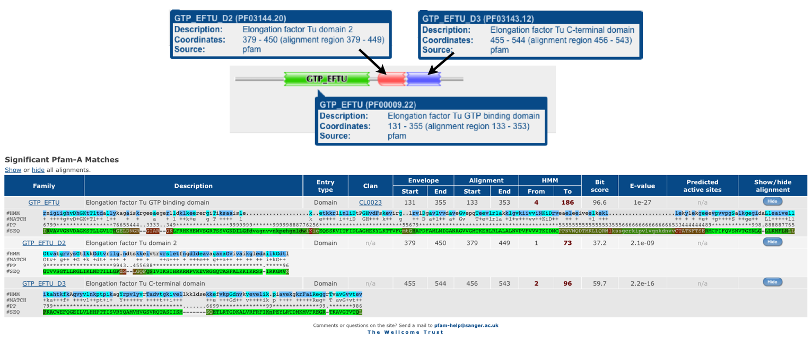
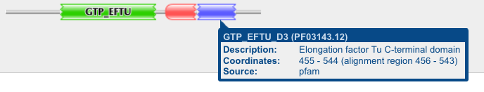
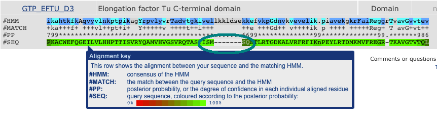
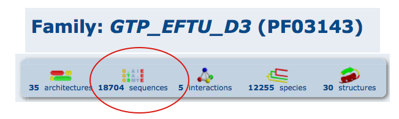

## 6. Domain search and functional characterization of proteins

## Introduction

To get to know, which domains are in our proteins, we could use hmmer to identify conserved domains or predict transmembrane domains. In our case we want to check an existing HMM (hidden markov model) of an elongation factor with our ortholog proteins. The purpose of this task is to get to know the Hmmer package. Hmmer has two different applications. You can use _hmmbuild_ and _hmmpress_ from a multiple sequence alignment, to build a domain database. Another application to Hmmer is the command _hmmscan_. Run _hmmscan_ for a uncharacterized protein against a profile-HMM (pHMM) database to figure out the similarity to the stored models and with it the most likely characterization. 

1. Use the Octopus vulgaris orthologs that HaMStR identified to perform a domain annotation.
	a. Download the pHMM for the Elongation factor Tu GTP binding domain from the pfam webpage [http://pfam.sanger.ac.uk](http://pfam.sanger.ac.uk).
	
		I have downloaded the hidden markov model from http://pfam.sbc.su.se/family/PF00009 in the "Curation & Model"-Tab.
		
		wget http://pfam.sbc.su.se/family/PF00009/hmm 
		
	b. How many of your Octopus sequences contain the GTP domain?
		
		At first you have to convert to downloaded text file into a hmm-database:
		
		hmmpress3 hmm 
		
		I have moved the generated file into a direcotry, which is called hmm_database. 
		
		hmmscan3 --tblout hmm.tsv hmm_database/hmm orthologs/octopus_orthologs.fa >hmmscan.out
		
		There are four entries in the generated tsv-file. These proteins might be generated with high certainty by the downloaded markov model. This means that our sequence contains an Elongation factor Tu GTP domain. 
		
	c. Extract one of the Octopus sequences that contain the GTP domain and paste it into the Pfam webpage in order to get a full Pfam annotation
		
		for GTP in $(cat hmm.tsv | grep -v "^#" | cut -d" " -f15 | head -n 1) ; do grep "$GTP" -A 1 orthologs/octopus_orthologs.fa ; done
		>111211|lotgi_2713|lottia_gigantea|comp9298_c0_seq2
		MATAVETLQTPTDDMANGTNLFAPDDMDTEMSALTSKMALVSPTSEEYDSLAEIIKARVEEGQGENIYVIGIGEGDKPGLKDEDLEASVATLQSIAQSLGLECVCLRVRQAEKGKVSEFLLRKKVAQQDFMEIRVAVVGNVDAGKSTLLGVLTHGELDNGRGIARQKLFRHKHEMVSGRTSSVGNDILGFDVAGNVVNKPEHGNLDWIKICEQSSKVITFIDLAGHEKYLKTTVFGMTGHAPDFAMLMIGANAGVVGMTKEHLRLALALNVPVFVVVTKIDMCPPNVMQDTMKLLQRMLKSSGCRKIPVLVQNKDNVVCTATNFTSERMCPIFQVSNVTGENLGLLKMFLNLLSTRHKYDVTQPAEFQIDDTFSVPGVGTVVSGTLLRGLIKLNDTILLGPDSLGQFQSIVIKSIHRKRMPVKEVRGGQTASFALKKIKRSSIRKGMVMVSPKREPKACWEFQGEILVLHHPTTISVRYQAMVHVGSVRQTASIISMSQETLRTGDKALVRFRFIKNPEYLRTDMKMVFREGRTKAVGTVTQLFLQTGNNNSSTGATNNHYTRHQRSGKKSHQDGSSQAGRSQSNSQKQNKKGRRPRNHKSP
		
	
	
	d. Run hmmscan3 locally to annotate the sequence with Pfam. The Pfam database is located at _/project/kurs-home/share/abi2013/data/Pfam-A.hmm_. Don't copy the file, just use it when you run hmmscan3.
		
		I have used the same parameters like in the online query.
		hmmscan3 --incE 1.0 --tblout annotation.tsv /project/kurs-home/share/abi2013/data/Pfam-A.hmm selectedSequence.fq 
	
	e. Compare the online and your local result.
		
		There are more entries in the local result. Besides the GTP domain site, there were some other protein-domains with lower E-value detected. 
		
		#                                                                                             --- full sequence ---- --- best 1 domain ---- --- domain number estimation ----
		# target name        accession  query name                                         accession    E-value  score  bias   E-value  score  bias   exp reg clu  ov env dom rep inc description of target
		#------------------- ----------                               -------------------- ---------- --------- ------ ----- --------- ------ -----   --- --- --- --- --- --- --- --- ---------------------
		GTP_EFTU             PF00009.20 111211|lotgi_2713|lottia_gigantea|comp9298_c0_seq2 -            1.8e-28   98.9   0.1   2.9e-28   98.2   0.1   1.3   1   0   0   1   1   1   1 Elongation factor Tu GTP binding domain
		GTP_EFTU_D3          PF03143.10 111211|lotgi_2713|lottia_gigantea|comp9298_c0_seq2 -            2.7e-14   53.0   3.0   4.8e-14   52.2   0.1   2.8   3   0   0   3   3   3   1 Elongation factor Tu C-terminal domain
		GTP_EFTU_D2          PF03144.18 111211|lotgi_2713|lottia_gigantea|comp9298_c0_seq2 -            3.9e-10   39.4   1.1   1.8e-09   37.2   0.2   2.5   2   0   0   2   2   2   1 Elongation factor Tu domain 2
		PduV-EutP            PF10662.2  111211|lotgi_2713|lottia_gigantea|comp9298_c0_seq2 -            0.00011   21.3   0.1      0.24   10.5   0.0   3.4   2   1   1   3   3   3   2 Ethanolamine utilisation - propanediol utilisation
		Miro                 PF08477.6  111211|lotgi_2713|lottia_gigantea|comp9298_c0_seq2 -             0.0014   18.8   0.3     0.027   14.6   0.1   3.1   3   1   0   3   3   3   1 Miro-like protein
		Arf                  PF00025.14 111211|lotgi_2713|lottia_gigantea|comp9298_c0_seq2 -             0.0081   15.1   0.2       1.4    7.8   0.0   2.5   2   0   0   2   2   2   2 ADP-ribosylation factor family
		Septin               PF00735.11 111211|lotgi_2713|lottia_gigantea|comp9298_c0_seq2 -              0.045   12.4   0.1     0.074   11.7   0.0   1.3   1   0   0   1   1   1   1 Septin
		Dynamin_N            PF00350.16 111211|lotgi_2713|lottia_gigantea|comp9298_c0_seq2 -               0.28   10.6   2.6      0.48    9.9   0.1   2.5   2   1   0   3   3   3   1 Dynamin family
		
	f. Which PFAM domain is located at the C-terminus of the protein?
	
		It is the Elongation factor Tu C-terminal domain. There is a good summary of this protein domain at the pfam-website. The GTP_EFTU_D3 entry refers to it. Website:  [http://pfam.sanger.ac.uk/family/PF03143.12](http://pfam.sanger.ac.uk/family/PF03143.12). For a Figure see 1.c. 
	
	i. How many match states does the corresponding model contain?
		
			hmmstat3 hmm
			# hmmstat3 :: display summary statistics for a profile file
			# HMMER 3.0 (March 2010); http://hmmer.org/
			# Copyright (C) 2010 Howard Hughes Medical Institute.
			# Freely distributed under the GNU General Public License (GPLv3).
			# - - - - - - - - - - - - - - - - - - - - - - - - - - - - - - - - - - - -
			#
			# idx  name                 accession        nseq eff_nseq      M relent   info p relE compKL
			# ---- -------------------- ------------ -------- -------- ------ ------ ------ ------ ------
			1      GTP_EFTU             PF00009.22        218     3.32    188   0.59   0.60   0.45   0.04
			
			M is the number of states, which belong to the corresponding model.
		
	ii.  Is this domain completely present in the Octpus sequence or only partially?
			
		The domain is partially present in the sequence.
			
	iii. If it is only partially represented, which end is missing? 
	
	
	
		One amino is missing at the beginning (N-terminus) and one amino is missing at the other end (C-terminus). 
		
	iv.  Are there any regions in the domain/pHMM where insertion are very likely?
	
		
	g. How many proteins in PFAM contain the same domains as your query?
	
		There are 18.704 sequences, which have a similar domain as my queried sequence.
	
	
			
	h. What function does your query protein most likely have?
	
		My queried sequence contains three domains. This three domains are likely to occure together in one peptide and all three domains are found within the queried amino sequence, so I assume that it is the GTP-binding elongation family, which are elongation factors.
		
## Discussion

We figured out, that four of our Octopus sequences do contain the GTP domain. We selected one of those sequences to annotate it with the Pfam database. The Pfam database is a large collection of protein families, each represented by HMMs and multiple sequence alignments. All three domains of the Elongation factor are found in our sequence. The high E-value of our result tells us, that it is very likely that this is sequence is responsible for the elongation. 