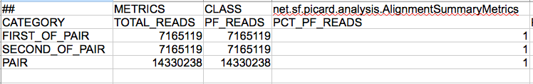
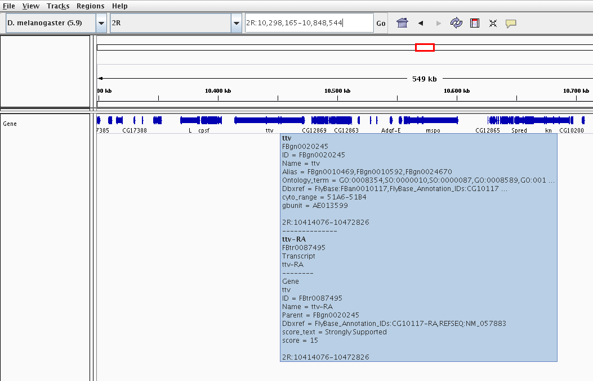
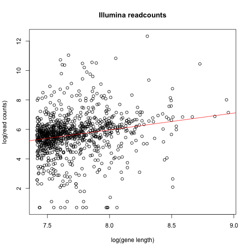
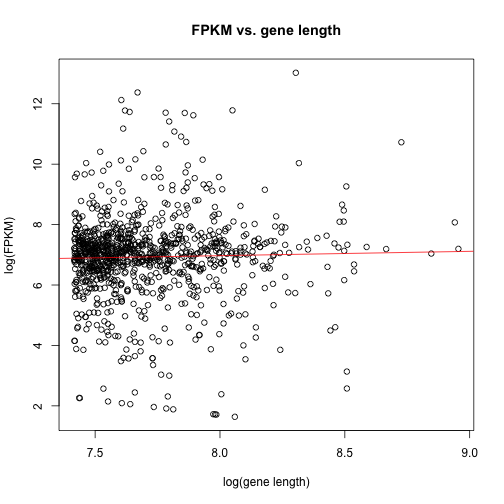
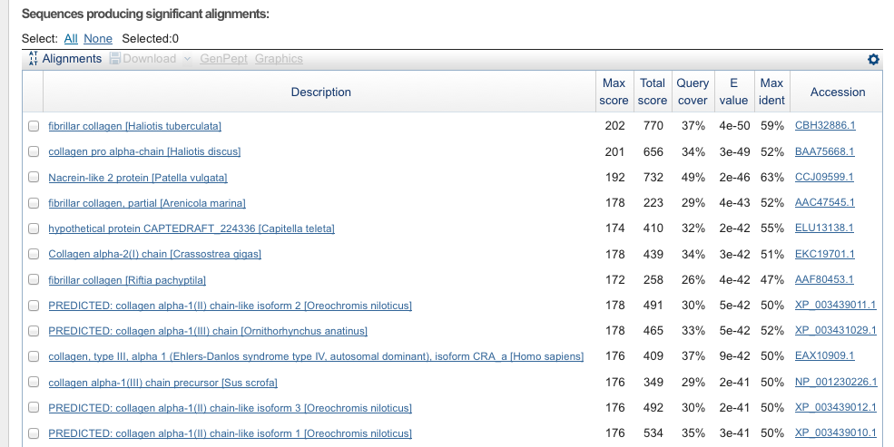

# 7 RNA-Seq and SNP calling

## 7.1. Map your RNA-Seq data to your reference genome

## Introduction

This exercise is to learn how to deal with RNA-Seq data and how to get some relevant biological information. At first we need to map our data to a reference genome. As a reference we use the transcriptome assembled by Trinity. We filterd our reads based on the quality and counted them with _htseq_ and its default parameters. A brief expression analysis with the FPKM value was calculated to extract highly expressed genes. 

## 7.1.1. Obtain your data
	
1. Explore the file using the command less. If you try to open it with gedit, kwrite or another text editor your computer may hang up due to the size of the file

		We just looked at the fastq file with head:
	
		$> head Illumina_paired.fq
		@SRR331946.1/1 ILLUMINA-FCBE01_0027_FC:3:1:1549:1145/1 length=145
		TAGGATNGAAGGTGAGGGATCGTTTTTCAACTCACAAGGATTCTTTGCCAAAAGAAAAGGAATTGTTTCTCGACCAATAC
		+SRR331946.1/1 ILLUMINA-FCBE01_0027_FC:3:1:1549:1145/1 length=145
		DDDD<?(D>DA=:?ADDDD,DB<DDDDB<DDDD2DDDDD28DDB>7*BB@DB3<7;;**1<<><<1;*87.57:>BD:DB
		@SRR331946.1/2 ILLUMINA-FCBE01_0027_FC:3:1:1549:1145/2 length=145
		CAGCCTTGAAACCAAGATTTTCCCCAATTCTTTCCAAAATTCCACCCAAGATCACAGGA
		+SRR331946.1/2 ILLUMINA-FCBE01_0027_FC:3:1:1549:1145/2 length=145
		A>>:*5?AAA@@AAA0AA5A>>*<<6><+(A9<<A::A</:*/A7<2<:A<*(>*A*<A
		
		$> head new_reads.fq
		@SRR108980.1 FB0Y0UD04DU6LO length=271
		TCAGGTGATGACTGGCGGTTTGTCTTATTCCAGCATGAGCAATAAGATTTATAGCGACATGGGGATGGATTGGATGAACCAAGAACAGACCACAGGGACGTACAATTAGTCTGCAGTTGTAATTTAAATTAGGTTGGGTGGTAGGTCATCGGGCGTGATTCTAAGAATACAACCAAGCAGGAGGTTTTAACTAATTGTCAAATACGAGTAACGTAGATAAGTTAGTACGAAAGAATAGTACTGATTACTATTACTTATTGTCGCNCTGTGN
		+SRR108980.1 FB0Y0UD04DU6LO length=271
		AAA===AAAAAAAAAAB?===AAFAABBBFFFFFFFFIIIIIIIIFFBBAAAB>==@??A???999=AAAA???@BAA===<==AA?@=>>==?<<<22.2:=66660000.................//444333332113............,434........24......224.....22.......*.-----66---*6---6;6---0--3882220,,,,,,,,,**,,2,,,,,,,22,,,,,,,,,,,,10,,,!,1,,,!
		@SRR108980.2 FB0Y0UD04DT4G9 length=241
		TCAGGTTCCTAACGGTAAGCTGGATATTTGGGGAAATGGTCTTTGTCCCGGGCAGATGCAACGTTCTCCTTACGCTGCCTCATACGCTGAAGAGATGAATCCAGTTAAACAAACCCTACGTCTCCAATGTCACTGGAACGATCTGTTTTGGGTTGGTTGTCTGTTAAAGAATGGTATCATACTTGCCGCCTGATACTCTTGGTCGTCCTACTGGTAGGCTGAGCGGGCGTGGCGAAGGCGN
		+SRR108980.2 FB0Y0UD04DT4G9 length=241
		AABB@???>894244377====>?=<333????:::?>A??332?7444<<<499???@@@?AA?????AAB?A???AAAA??????===?AAAAAAAAAA@@@@@@@72...116.,,.399;;...11643444;74...43.......333662.0006977....++44434346668....43...4433----------668------33----22,,,,,,,5522,,,2,,,!
		
2. What kind of sequencing technology is this?
	
		We have illumina and 454 reads. 
	
3. Are those paired end reads?

		The illumina-reads are paired end. The 454 data is single end. 
		
4. How many reads are in each of the files?
	
		The following command `grep -c "@" Illumina_paired.fq` shows, that there are 29154685 reads in the illumina file.
		And `grep -c "@" new_reads.fq` gives us 14673 reads for the 454 file.
	
5. What other file formats do you know to store NGS reads? Name at least 3 different formats.
		
		* GenBank FLATFILES
		* PHYLIP
		* MSF
		* NEXUS
		
## 7.1.2. Map your data

1. Run NextGenMap using: submit2sge q compute 'ngm -r Ref.fasta -q READFILE.fq -o output.sam' for both data sets. When you run ngm with the Illumina data, add the parameter -p to inform the program that this is paired-end data.
		
2. What does NextGenMap do? NextGenMap maps the reads against a reference genome and aligns them.

		NextGenMap maps the reads against a reference genome and aligns them. 
		
## 7.1.3. Filter your data

1. Convert the two SAM files (one for mapped Illumina reads and other one for 454 reads) into sorted BAM files and index them.

		samtools view -b -S Illumina.sam > Illumina.bam
		samtools sort Illumina.bam Illumina.bam.sorted
		samtools index Illumina.bam.sorted.bam Illumina.indexed
		
2. Filter your data for proper pairs and mapping quality (Q) 20. What does Q20 mean?

		samtools view -q 20 -f 0x0002 -b Illumina.bam.sorted.bam -o Illumina.sorted.q20
		
		Q = -10 log10(P). The original probability P, that this base is wrong is: 0.01 %

3. Sort your data using SAMtools.

		samtools sort Illumina.bam Illumina.bam.sorted
		
4. Pileup your mapped data and compute the per-base coverage. Which is the highest per-base coverage for each of the data set.

		#!/usr/bin/python

		import sys
		import re
		
		file = sys.argv[1]
		seq = {}
		fobj = open(file, "r")
		for line in fobj :
		m = re.search("\A(\w*)\s*(\d*)\s*\w*\s*(\d*)", line)
		sequence = m.group(1)
		pos = m.group(2)
		coverage = m.group(3)
		max = 0
		if sequence in seq :
			max = int(seq[sequence][0])
		else :
			seq[sequence] = [coverage, pos]
		if coverage > max :
			seq[sequence][0] = coverage
			seq[sequence][1] = pos
		for sequence in seq.keys() :
		print sequence + ":" + seq[sequence][0] + " # " + seq[sequence][1]

5. Merge the two mapped read files and assign readgroups to each of the read data set

		samtools merge -r -f merge.bam Illumina.sorted.q20.bam new_reads.sorted.q20.bam
		
## 7.1.4. Explore your data

1. How many reads mapped on the plus and on the minus strand? Use samtools view.

		samtools view -F 0x0010 Illumina.sorted.q20.bam | wc -l
		4250510
		samtools view -f 0x0010 Illumina.sorted.q20.bam | wc -l
		4243855
	
2. Which additional SAM file flags does NGM provide. Are they any useful?
		
		SRR331946.8248833/1     69      comp10550_c0_seq1       171     0       *       =       171     0       ATAAATGAAGAAACATGCTGCTCCCCGACACCCAATTTCACATTGCAGTAAATATGTGGTTGAAACCAAGCCAAAGTAAAAAAAAAAACAAAACAAAAAAAAATATTTAAGATCGGAAGAGCGGTTCA    @=A:<>6:CCBBEB@GB<F>DBDA>A?A:DD=DF9HHHH>FHHDD>>DGEG>GHHFHHHEHHHEGDDGBE@DDGGGGBG@G<GHHHHHHHHHHGFHHHG>GGGGGGBGEHHFHFHHHHH@HHHGHHHH
		SRR331946.8248833/2     137     comp10550_c0_seq1       171     1       3M1D6M2D23M1I3M1I10M1D3M1D11M1D8M2I1M2I1M1I4M2I9M1D8M       =       171     0       TAAATATTTTTTTTTGTTTTGTTTTTTTTTTTACTTTGGCTTGGTTTCAACCACATATTTACTGCCATGTGAAATTGGGTGTCGGGGAGCAGCATGTTT GGBGGGHGGFHHHHHGHDHFHHHHHHHHHHHH?<BGGGG3GGEG8GGG8GHHHHHHHHGHAGDGG*CGCA?8;=>GGGDBGB@GDCA2AA?BCAC</B?     AS:i:207   NM:i:21  XI:f:0.650943   X0:i:1  X1:i:42 XE:i:4  XR:i:99 MD:Z:3^G1C4^CC6T9G6G2CT3TC3^A3^T2TGGA2CA1^A1G1G12ATT2T1^A4C3
		
		NGM extends the SAM file with additional information, which you can see in the last line of the SAM-entry example above. 
		
		AS...Alignment sore
		NM...Number of mismatches in the alignment (does not include insertions and deletions)
		XI...Identity of the alignment
		X0...Number of equal scoring hits
		X1...Number of suboptimal hits found
		XE...Number of supported seeds
		XR...Number of aligned residues
		MD...Mismatched and deleted positions/bases
		
		This gives additional information for each reads, which is of course useful. 
	
3. How many reads mapped with no mismatch/gap?

		cat Illumina.sam | grep "NM:i:0" | wc -l
		There are 6.979.529 reads with no mismatches in the alignment. 

		The above command does not include gaps. To get to know which reads have gaps in the alignment, you have to process the cigar string.

4. Use picard-tools to obtain mapping statistic

		picard-tools CollectAlignmentSummaryMetrics INPUT=Illumina.sorted.pp.bam OUTPUT=picard.out

		\#\# METRICS CLASS        net.sf.picard.analysis.AlignmentSummaryMetrics
		CATEGORY        TOTAL_READS     PF_READS        PCT_PF_READS    PF_NOISE_READS  PF_READS_ALIGNED        PCT_PF_READS_ALIGNED    PF_ALIGNED_BASES    PF_HQ_ALIGNED_READS     PF_HQ_ALIGNED_BASES     PF_HQ_ALIGNED_Q20_BASES PF_HQ_MEDIAN_MISMATCHES PF_MISMATCH_RATE        PF_HQ_ERROR_RATE    PF_INDEL_RATE   MEAN_READ_LENGTH        READS_ALIGNED_IN_PAIRS  PCT_READS_ALIGNED_IN_PAIRS      BAD_CYCLES      STRAND_BALANCE  PCT_CHIMERAS        PCT_ADAPTER     SAMPLE  LIBRARY READ_GROUP
		FIRST_OF_PAIR   7165119 7165119 1       0       0       0       0       0       0       0       0       0       0       0       134,998015 0
		SECOND_OF_PAIR  7165119 7165119 1       0       0       0       0       0       0       0       0       0       0       0       133,290608 0
		PAIR    14330238        14330238        1       0       0       0       0       0       0       0       0       0       0       0       134,144311  0       0       0       0       0       0
	
	

5. Use IGV (the Integrative Genomics Viewer) to examine the BAM les from above.

	
	
	IGV could be used to ensure that your experiment was successful. In this example we have enriched enriched exonic regions in the octopus genome. For the octopus genome, there is no reference genome available, so we compare it to a specy, which is close related. The local blast search revealed, that a closely related specy is drosophila melanogaster. In the Figure above you can see, that there are some exonic regions enriched. 
	
	
## 7.1.5 Use htseq-count to count the number of reads mapped in each gene

1. Produce your own GFF file for all contigs and state how you procuded that.

		The general feature format (gene-finding format, generic feature format) is a file format used to describe features of sequences. This features could be genes, RNA, protein sequences and so on. I have used the 1000 contig fasta-file, produced in 3.15. 
		
		perl -n -e '/^>([A-Za-z0-9_]*)\s+len=([0-9]*)/ && print "$1 cibiv transcript 0 $2 . + .\n"' 1000longest.fa >fake.gff
		
		head fake.gff
		comp1439_c0_seq1 cibiv transcript 0 2426 . + .
		comp1469_c0_seq1 cibiv transcript 0 2664 . + .
		comp1481_c0_seq1 cibiv transcript 0 2545 . + .
		comp1481_c0_seq2 cibiv transcript 0 2546 . + .
		comp1506_c0_seq2 cibiv transcript 0 1941 . + .
		comp1506_c0_seq3 cibiv transcript 0 1941 . + .
		comp1527_c0_seq1 cibiv transcript 0 2013 . + .
		comp1561_c0_seq1 cibiv transcript 0 2174 . + .
		comp1599_c0_seq1 cibiv transcript 0 2425 . + .
		comp1609_c0_seq1 cibiv transcript 0 2133 . + .
		
2. Explore the GFF file. What columns do you think you need for counting? How many contigs/genes are in the GFF file?

		cat fake.gff | wc -l
		1000
		
		There are 1000 contigs in the gff file. 
		
## 7.1.6 Import data to R

### 1. Importing the data into Rstudio:

	counts_454 = read.csv2("htseq.new_reads.formated.couts", header = FALSE, sep = "\t")
	counts_ill = read.csv2("htseq.formated.couts", header = FALSE, sep = "\t")
	gff = read.csv2("Ovulgaris.gff", header = FALSE, sep = "\t")

### 2. Merging the data:

	gff_ill = merge(counts_ill, gff, by = "V1")
	colnames(gff_ill) = c("V1", "counts.Ill", "Annotation", "attribute", "start", "end", "score", "strand", "frame", "gene_ID")
	merged_data = merge(counts_454, gff_ill, by = "V1")
	colnames(merged_data)[2] = "counts.454"

### 3. Explore your data:

	names(merged_data)

	##  [1] "V1"         "counts.454" "counts.Ill" "Annotation" "attribute" 
	##  [6] "start"      "end"        "score"      "strand"     "frame"     
	## [11] "gene_ID"

	head(merged_data)

	##                  V1 counts.454 counts.Ill Annotation attribute start  end
	## 1 comp10012_c0_seq1          0       4896    Ensembl      exon   100 1844
	## 2 comp10030_c0_seq1          0        235    Ensembl      exon   100 1922
	## 3 comp10035_c0_seq1          0        244    Ensembl      exon   100 2782
	## 4 comp10041_c0_seq1          0        491    Ensembl      exon   100 2601
	## 5 comp10047_c0_seq1          0        337    Ensembl      exon   100 2177
	## 6 comp10047_c0_seq2          0         88    Ensembl      exon   100 2159
	##   score strand frame                   gene_ID
	## 1    42      +     . gene_id=comp10012_c0_seq1
	## 2    42      +     . gene_id=comp10030_c0_seq1
	## 3    42      +     . gene_id=comp10035_c0_seq1
	## 4    42      +     . gene_id=comp10041_c0_seq1
	## 5    42      +     . gene_id=comp10047_c0_seq1
	## 6    42      +     . gene_id=comp10047_c0_seq2

### 4. Calculate library sizes and FPKM:

		merged_data$length = (merged_data$end - merged_data$start)
		library_size = sum(merged_data$counts.Ill)
		merged_data$FPKM = (1e+10 * merged_data$counts.Ill/merged_data$length)/library_size

### 5. Explore your data:

	names(merged_data)

	##  [1] "V1"         "counts.454" "counts.Ill" "Annotation" "attribute" 
	##  [6] "start"      "end"        "score"      "strand"     "frame"     
	## [11] "gene_ID"    "length"     "FPKM"

	head(merged_data)

	##                  V1 counts.454 counts.Ill Annotation attribute start  end
	## 1 comp10012_c0_seq1          0       4896    Ensembl      exon   100 1844
	## 2 comp10030_c0_seq1          0        235    Ensembl      exon   100 1922
	## 3 comp10035_c0_seq1          0        244    Ensembl      exon   100 2782
	## 4 comp10041_c0_seq1          0        491    Ensembl      exon   100 2601
	## 5 comp10047_c0_seq1          0        337    Ensembl      exon   100 2177
	## 6 comp10047_c0_seq2          0         88    Ensembl      exon   100 2159
	##   score strand frame                   gene_ID length    FPKM
	## 1    42      +     . gene_id=comp10012_c0_seq1   1744 22837.8
	## 2    42      +     . gene_id=comp10030_c0_seq1   1822  1049.2
	## 3    42      +     . gene_id=comp10035_c0_seq1   2682   740.1
	## 4    42      +     . gene_id=comp10041_c0_seq1   2501  1597.1
	## 5    42      +     . gene_id=comp10047_c0_seq1   2077  1319.9
	## 6    42      +     . gene_id=comp10047_c0_seq2   2059   347.7

### 6. How is FPKM calculated in detail?

(readcounts / gene length) / library_size

FPKM stands for Fragments Per Kilobase of transcript per Million mapped reads. In RNA-Seq, the relative expression of a transcript is proportional to the number of cDNA fragments that originate from it. The FPKM gives the proportion of the reads, which map to a gene, with consideration of gene length and total read sum of the experiment. 

### 7. Plot counts vs. gene length:

	cleaned_data <- merged_data[merged_data$counts.Ill > 0, ]
	plot(log(cleaned_data$length), log(cleaned_data$counts.Ill), xlab = "log(gene length)", ylab = "log(read counts)", main = "Illumina readcounts")
	abline(lm(log(cleaned_data$counts.Ill) ~ log(cleaned_data$length)), col = "red")

 

	cor.test(log(cleaned_data$length), log(cleaned_data$counts.Ill), method = "spearman")

	## Warning: Cannot compute exact p-values with ties

	## 
	## 	Spearman's rank correlation rho
	## 
	## data:  log(cleaned_data$length) and log(cleaned_data$counts.Ill) 
	## S = 114790853, p-value < 2.2e-16
	## alternative hypothesis: true rho is not equal to 0 
	## sample estimates:
	##   rho 
	## 0.266

### 8. What do you see? Check the result from the correlation test. Is there a significant correlation between the read counts and the gene length? Why?

Based on the small pValue and Spearmans rho of 0.266 , one can assume that there is a correlation between gene length and the read counts. It is not suprising because the longer a gene is, the more likely it is, that a randomly chosen read maps to it.

### 9. Plot FPKM vs. gene length

	cleaned_data <- merged_data[merged_data$FPKM > 0, ]
	plot(log(cleaned_data$length), log(cleaned_data$FPKM), xlab = "log(gene length)", ylab = "log(FPKM)", main = "FPKM vs. gene length")
	abline(lm(log(cleaned_data$FPKM) ~ log(cleaned_data$length)), col = "red")

 

	cor.test(log(cleaned_data$length), log(cleaned_data$FPKM), method = "spearman")

	## Warning: Cannot compute exact p-values with ties

	## 
	## 	Spearman's rank correlation rho
	## 
	## data:  log(cleaned_data$length) and log(cleaned_data$FPKM) 
	## S = 149551487, p-value = 0.1719
	## alternative hypothesis: true rho is not equal to 0 
	## sample estimates:
	##    rho 
	## 0.0437

### 10. What do you see? Check the result from the correlation test. Is there a significant correlation between the FPKM and gene length? Why?

Based on the bad pValue of 0.1719 and on the small value of Spearmans rho, which is very close to zero one can not assume that there is a correlation between those two. This effect is due to the fact, that the FPKM value is normalized with the gene length. 

### 11. Extract the 10 genes with the highest expression level:

	head(merged_data[order(merged_data$FPKM, decreasing = TRUE), ])

	##                    V1 counts.454 counts.Ill Annotation attribute start
	## 475 comp11871_c0_seq1          0     225125    Ensembl      exon   100
	## 452 comp11816_c0_seq1          0      62331    Ensembl      exon   100
	## 702  comp3198_c0_seq1          0      45409    Ensembl      exon   100
	## 980  comp9807_c0_seq1          1      50398    Ensembl      exon   100
	## 416 comp11777_c0_seq1          0      32594    Ensembl      exon   100
	## 700  comp3176_c0_seq1          0      31678    Ensembl      exon   100
	##      end score strand frame                   gene_ID length   FPKM
	## 475 4139    42      +     . gene_id=comp11871_c0_seq1   4039 453429
	## 452 2243    42      +     . gene_id=comp11816_c0_seq1   2143 236614
	## 702 2108    42      +     .  gene_id=comp3198_c0_seq1   2008 183966
	## 980 3234    42      +     .  gene_id=comp9807_c0_seq1   3134 130820
	## 416 2138    42      +     . gene_id=comp11777_c0_seq1   2038 130105
	## 700 2176    42      +     .  gene_id=comp3176_c0_seq1   2076 124134

### 12. Blast the gene with highest expression level at the NCBI? What gene is reported with the highest Blast hit?

Fortunately this sequence is in the 1000longest.fa file. I have extracted the sequence with sed in unix:

    sed -e '/^>comp11871_c0_seq1/,/>/!d' 1000longest.fa
    
I have used blastx, to find similar proteins in the translated database. Most of the findings refer to fibrillar collagen or collagen alpha, which is especially in flesh and connective tissues in mammals. 

    

### 13. Let us compare the two data sets. Check what genes are expressed acording to the 454 data:

	merged_data[merged_data$counts.454 > 0, ]

	##                    V1 counts.454 counts.Ill Annotation attribute start
	## 90  comp10556_c0_seq1          5       5116    Ensembl      exon   100
	## 139 comp10798_c0_seq1          1        316    Ensembl      exon   100
	## 163 comp10955_c0_seq3         59       3547    Ensembl      exon   100
	## 164 comp10957_c0_seq1          4       1252    Ensembl      exon   100
	## 195 comp11086_c0_seq1          1        404    Ensembl      exon   100
	## 261 comp11334_c0_seq1          1       5459    Ensembl      exon   100
	## 376 comp11711_c0_seq1          1        782    Ensembl      exon   100
	## 730  comp3712_c0_seq1          1        768    Ensembl      exon   100
	## 805  comp7439_c0_seq1          1        429    Ensembl      exon   100
	## 980  comp9807_c0_seq1          1      50398    Ensembl      exon   100
	##      end score strand frame                   gene_ID length   FPKM
	## 90  2011    42      +     . gene_id=comp10556_c0_seq1   1911  21779
	## 139 2034    42      +     . gene_id=comp10798_c0_seq1   1934   1329
	## 163 3108    42      +     . gene_id=comp10955_c0_seq3   3008   9593
	## 164 1920    42      +     . gene_id=comp10957_c0_seq1   1820   5596
	## 195 1933    42      +     . gene_id=comp11086_c0_seq1   1833   1793
	## 261 2431    42      +     . gene_id=comp11334_c0_seq1   2331  19052
	## 376 1796    42      +     . gene_id=comp11711_c0_seq1   1696   3751
	## 730 2996    42      +     .  gene_id=comp3712_c0_seq1   2896   2157
	## 805 1823    42      +     .  gene_id=comp7439_c0_seq1   1723   2025
	## 980 3234    42      +     .  gene_id=comp9807_c0_seq1   3134 130820

	counts <- data.frame(counts_454$V2, counts_ill$V2)
	libSize <- apply(counts, MARGIN = 2, sum)

### 14. Discussion

There are 2 different read counts, one for the 454 reads and one for the illumina reads. The library size of the 454 reads is really small in comparison to the library size of the illumina reads. There is no really differential expression, which is obvious by eye. For computing a differential expression methods like edgeR, DESeq or bayseq (within R) could be used. 

In both cases there is a high expression in the 3rd sequence with the label comp10955\_c0\_seq3. 

